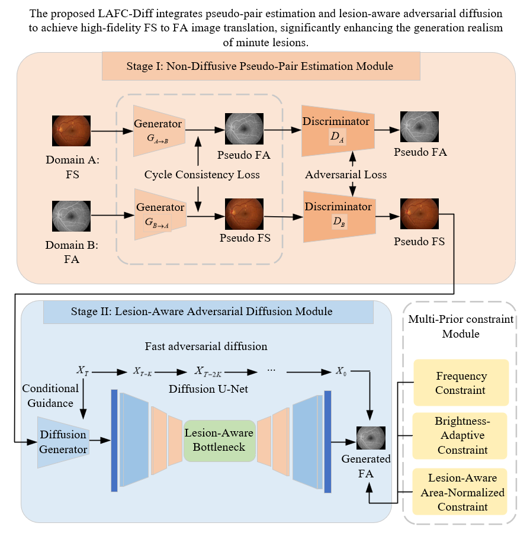

# 👁️ LAFC-Diff

**Lesion-Aware and Frequency-Constrained Diffusion for Cross-Modal Retinal Image Translation**

 <!-- 替换为实际链接 -->

> **Abstract:** 
> Fundus Fluorescein Angiography (FA) is a vital tool for diagnosing fundus vascular diseases like Diabetic Retinopathy (DR). However, this invasive examination carries potential risks. Recently, deep learning-based cross-modal image generation provides a new approach to synthesize FA images from safe **Fundus Structure (FS)** images. 
>
> Yet, existing generative models struggle with weakly registered fundus images and often fail to preserve the continuity of capillary terminals. Furthermore, large normal background areas completely dominate these images. As a result, traditional global optimization mechanisms easily overlook minute lesions like microaneurysms and dot hemorrhages, causing severe missed diagnoses or rendering errors. 
> 
> To address this issue, a **lesion-aware and frequency-constrained adversarial diffusion network (LAFC-Diff)** is proposed to improve the generation of tiny lesions. The proposed model achieves superior results across SSIM (0.693), PSNR (18.84), and LPIPS (0.294) metrics on the Isfahan MISP dataset, outperforming state-of-the-art (SOTA) algorithms.

💖 If you find this repository useful for your research, please consider giving it a star! 

---

## 📌 Table of Contents

- [The Proposed LAFC-Diff Architecture](#the-proposed-lafc-diff-architecture)
- [Requirements & Installation](#requirements--installation)
- [Dataset Preparation](#dataset-preparation)
- [Training & Evaluation](#training--evaluation)
- [Citation](#citation)

---

## 🧠 The Proposed LAFC-Diff Architecture

*(Please ensure your uploaded architecture diagram correctly shows the first-stage directional arrows originating directly from the Fundus Structure (FS) input domain.)*

Building upon the adversarial diffusion model, our framework effectively addresses the issue of losing small lesions against complex backgrounds through three core modules:

*   ⚡ **High-frequency Residual Constraint:** Explicitly aligns high-frequency features in the frequency domain to enhance the continuity and edge sharpness of the capillary network.
*   💡 **Brightness-adaptive Weighting Mechanism:** Dynamically assigns larger optimization weights to high-brightness pixels, significantly improving the generation of lesion regions.
*   🔍 **Local Lesion-aware Mechanism:** Guides the network to accurately attend to local lesion areas (such as microaneurysms), effectively elevating the generation quality of minute anomalies.
